# Chapter 3 程序的机器码表示

## 3.1
1. Intel 处理器俗称x86，x86 - 64 的前身是IA32 (Intel Architecture 32-bit)
2. Moore's Law: 晶体管数量每年翻倍

## 3.2
1. gcc -Og -o p p1.c p2.c 这里的 -Og是为了告诉编译器使用符合原始C代码整体结构的机器代码优化等级，否则机器代码和原始代码之间关系难以理解
### 3.2.1
1. 机器级代码：
   1. PC 在x86-64 用%rip表示
   2. 整数寄存器文件（16个64位）
   3. 条件码寄存器
2. 目前x86-64地址只使用48位，因此前16位需置0，因此一个地址实际上能指定2的48次方（64TB）
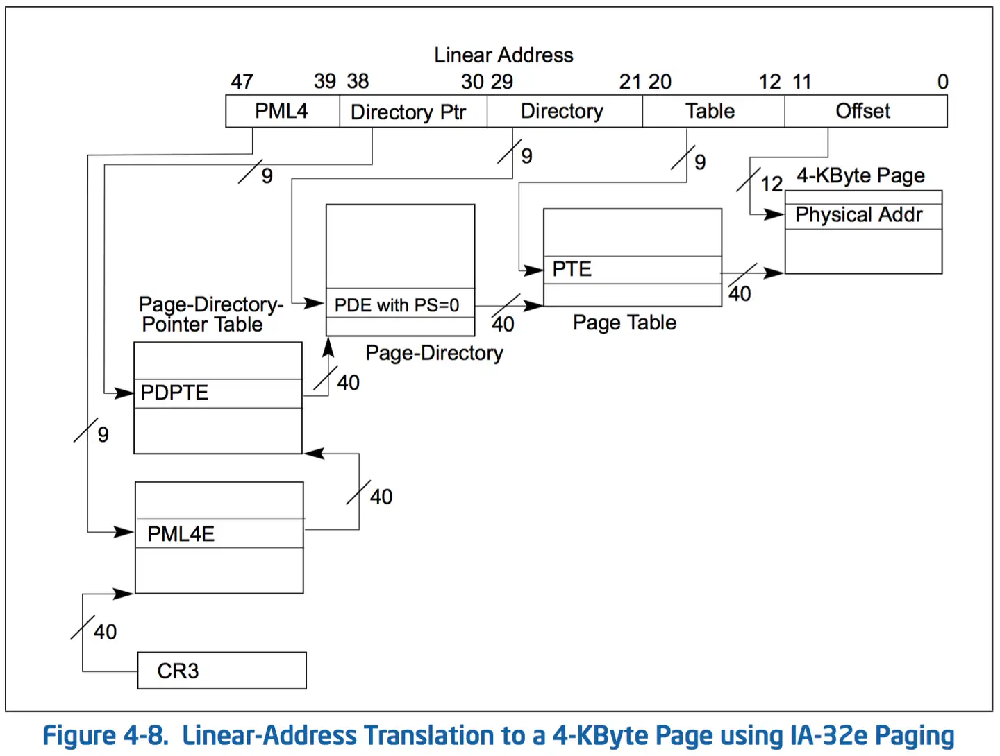

通过虚拟地址映射，操作系统可以把这些零散的物理碎片，拼接成一段在程序看来连续的虚拟空间，每个进程都有独立的CH3值，因此不会互相干扰。
CH3又分为User CH3 和 Kernel CH3 

### 3.2.2 
1. -S 指令能够看到.s的汇编文件代码 
2. x86-64 的机器代码和反汇编特性：
   1. 指令长度从1～15个字节不等
   2. 设计指令格式时，从某个给定的位置开始一定一个将字节唯一解码位机器指令，这个是由每个指令的前缀属性决定的，是ISA设计的必要原则
   3. 反汇编生产的指令和GCC生产的汇编代码使用的有小差异，比如说省略的call和ret后面的q
3. 默认使用的汇编代码格式是ATT（AT&T公司），在gcc增加-masm=intel可以使用intel的格式，常见差别有寄存器不加%，省略了知识大小的后缀，比如push和mov而不是pushq和movq，

## 3.3 数据格式
1. 由于从16位体系结构扩展到32位的，Intel用字表示16位数据类型；
2. 汇编代码后缀与字长关系：字节-b、字-w、双字-l、四字-q、单精度-s、双精度-l
3. 虽然l用了两次，但是由于浮点数使用了完全不同的指令和寄存器，所以不会冲突

## 3.4 
寄存器的结构
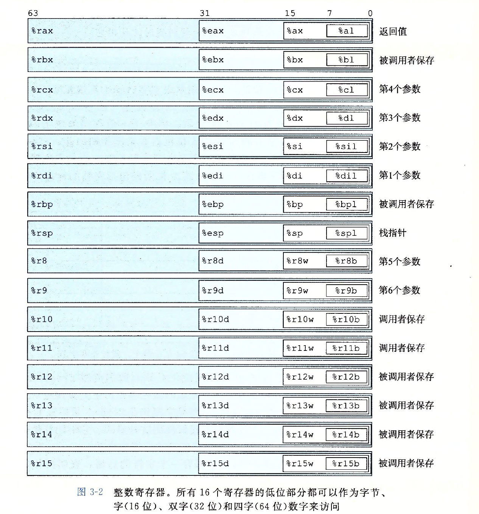

更多的寻址方法
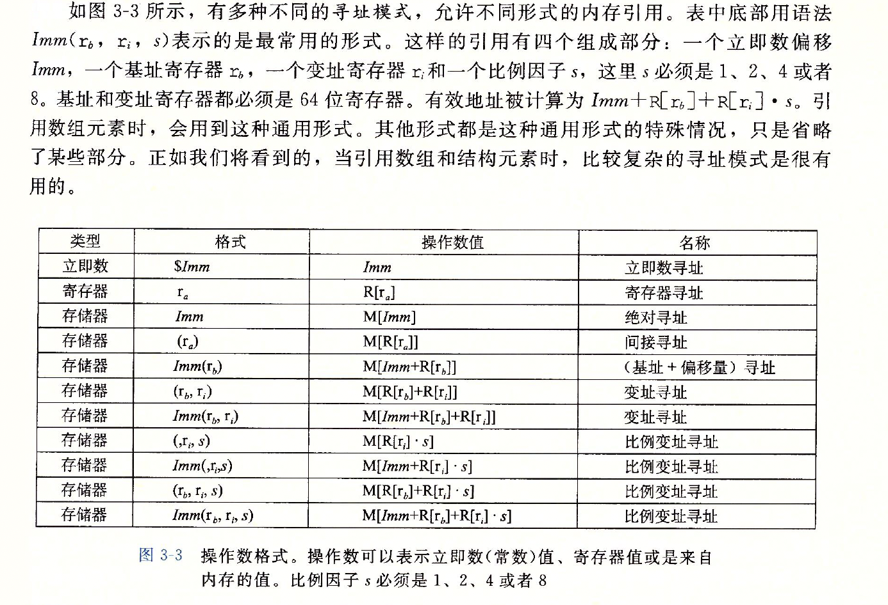

### 3.4.2 数据传输格式
立即数表示方法：\$之后加上标准C的整数，比如$-57
MOV（b,w,l,q,absq）absq为绝对四字，其中源操作数是一个立即数，储存在寄存器或者内存，目的必须是位置，寄存器位置或者内存地址；

x86-64加了一个限制，两个操作数不能同时是内存，MOV S,D； D⬅️S

并且，movq只能移动32位的然后扩展符号，只有movabsq才能真正移动一个64位的；

此外还有movs和movz，一个是符号扩展，一个是零扩展，并且后面要跟两个后缀；比如movzbw就是把零扩展的字节传输到字；

特殊的还有cltq，仅仅用来表示%eax符号扩展到%rax

注意点：表示内存地址的必须是64位寄存器，比如%rax而不能是%eax

## 3.5 算数逻辑操作
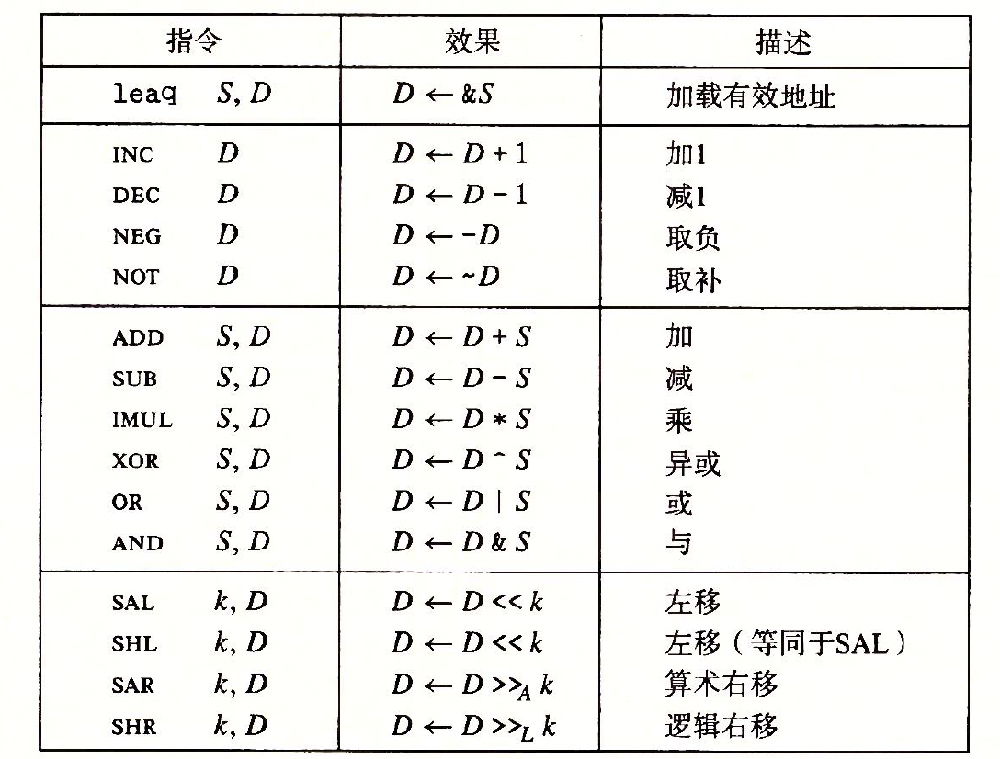
### 3.5.1 加载有效指令
1. lea （load effective address） ，高效的数学计算工具，他只会碰寄存器的值而不会去访问内存，比如 leaq 7（%rdx ， %rdx ， 4）， %rax，看上去是解引用，其实是Disp（base ， index ， scale）
2. lea的优势在于高效的乘法计算，不过计算的时候要保证scale是2，4，8

## 3.6 控制

### 3.6.1 条件码
1. 常见的操作码：CF（进位），ZF（零，最近操作得到的结果为0），SF（符号，最近操作得到的结果为负），OF（溢出，最近操作得到的结果溢出，分为正溢出和负溢出）
2. 除了leaq指令不影响操作码，其他的前面列出的算数逻辑操作指令会影响操作码
3. 有两类指令只影响操作码不影响寄存器，为cmp和test
   1. cmp S,D：相当于D-S，但是不保存结果，只影响操作码
   2. test S,D：相当于D & S，但是不保存结果，只影响操作码
   3. 这两个指令都分为b，w，l，q四种后缀
### 3.6.2 访问条件码
1. 条件码通常不会直接读取，有三种常见使用方法
   1. 根据条件码的某种组合，把某个字节设置为0 or 1
      * 被称为SET指令，set指令的后缀表示条件，而并非操作数大小 
       

   1. 可以执行条件跳转
   2. 可以有条件的传送数据

### 3.6.3 跳转指令
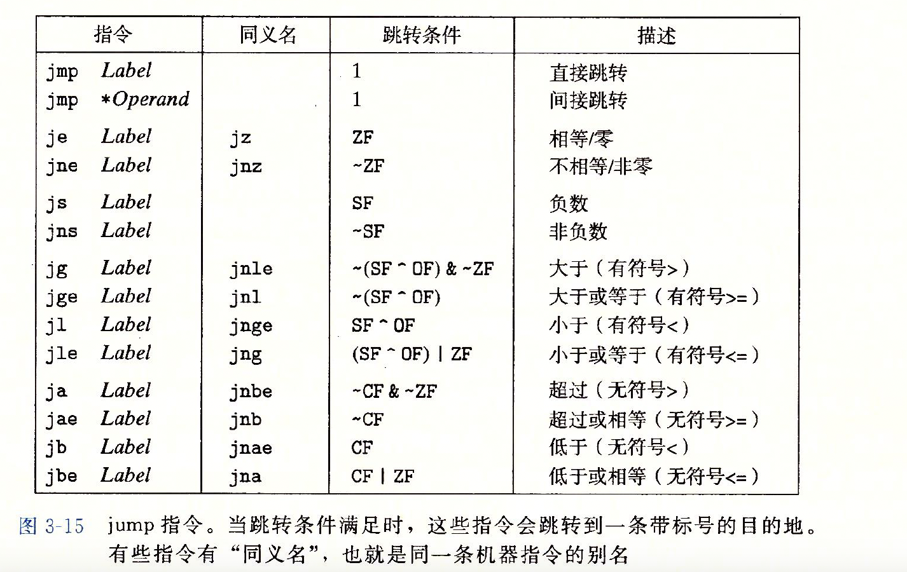

### 3.6.4 跳转指令的编码
1. PC相对寻址：跳转指令的目标地址不是一个绝对地址，而是一个相对于当前PC的偏移量
2. 目标地址 = (当前指令地址 + 当前指令长度) + 偏移量 = 下一条指令的地址 + 偏移量
3. 偶然出现的rep;ret除了能让代码在AMD上跑快一点之外，没有其他意义
   
### 3.6.5用条件控制实现条件分支
1. 类似if(p && a >= *p) 的虽然只有一个if，但是在汇编里面会产生两个分支，这是C语言的短路求值功能，即先看cond1，再看cond2

### 3.6.6 用条件传送实现条件分支
1. 在某些情况下，可以用条件传送指令来替代条件分支指令，从而避免分支预测失败带来的性能损失
2. 典型例子是if（x>y）return x-y ；else return y-x；
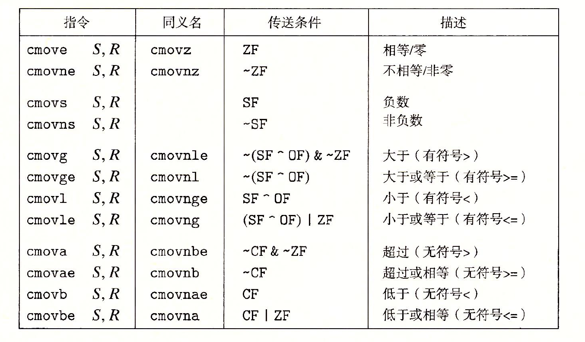

## 3.7 过程

### 3.7.1 运行时栈
1. x86-64的栈是向下增长的，也就是栈顶指针%rsp的值会随着数据的压入而变小
2. 当x86-64的过程需要的内存空间超出寄存器能提供的范围时，就会使用栈空间，这个部分被称作过程的栈帧(stack frame)
3. 当前正在执行的过程的帧总在栈顶
4. 当过程不超过六个参数的时候，所有的参数都会放在寄存器里，超过六个参数的才会放在栈上
5. x86寄存器里：%rax和%rsp用来保存栈顶和返回值，ABI 规定 rbx, rbp, r12, r13, r14, r15通常作为被调用者保存寄存器，挑选了剩下的前6个，即rdi, rsi, rdx, rcx, r8, r9 这 6个 作为参数传递寄存器

### 3.7.2 转移控制
1. 从函数P转移到函数Q只需要调整PC到Q的第一条指令的地址即可，同时需要保留住返回地址（压入栈顶，%rsp-8），以便Q执行完毕后能回到P继续执行，这个操作由call Q 调用过程Q来记录的，压入的地址被称作返回地址，对应的ret指令会从栈中弹出地址A，并把PC设置为A

### 3.7.3 数据传送

1. x86里大部分参数传递都是通过寄存器，当P调用Q时，将必要的参数复制到寄存器里
2. 通过寄存器最多传递6个整形参数
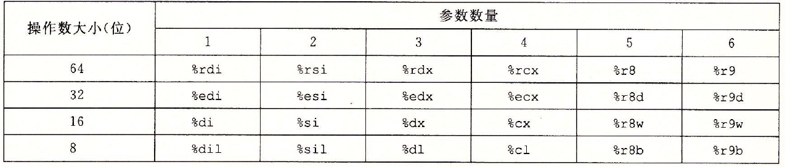
3. 如果调用的数量n>6，则第7个及其以后的参数会被压入栈中，最先压入的参数在栈顶
4. 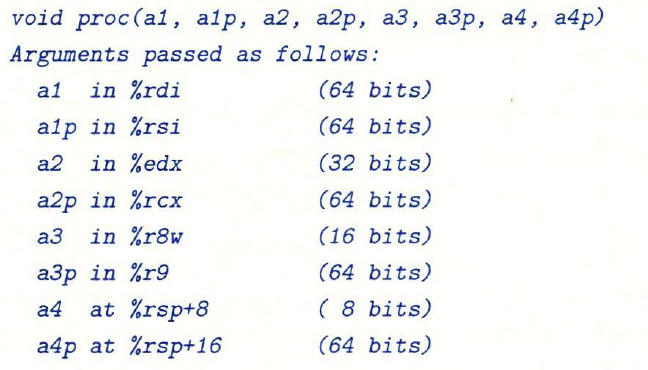

### 3.7.4 栈上的局部储存
1. 局部数据必须存放在内存的情况：
   1. 寄存器不够用
   2. 对一个局部变量使用地址运算，因此必须能够为他产生一个地址
   3. 某些局部变了是数组或者结构，因此必须能够被这些引用到

### 3.7.5 寄存器中的局部储存
1. %rbx 和 %rbp, r12, r13, r14, r15 作为被调用者保存寄存器，当P调用Q时，Q必须保存这些寄存器的值，要么就不去动这些值，要么就把它们的值先保存到栈上，等Q返回时再恢复这些值

## 3.8 数组的分配和访问

### 3.8.1 基本原则

1. 对于类型T和整形常数N，声明： T A[N];
   1. 分配一块大小为 sizeof(T) * N 字节的连续内存空间
   2. 引入了指针A，指向这块内存空间的起始地址
   3. 数组元素A[i]存放在地址A + i * sizeof(T)处
   4. 例如A位置在%rdx，i在%rcx，那么可以使用movl (%rdx,%rcx,4), %eax 来读取A[i]的值，允许的伸缩因子为1，2，4，8

### 3.8.3 嵌套数组

1. 定义数组 int A[5][3] 等价于 typedef int A_row[3]; A_row A[5], 因此A是一个有5个元素的数组，每个元素是一个有3个int的数组,总大小为5*3*4=60字节
2. 数组元素在内存中按照行优先的顺序，通常对于一个定义为 T A[M][N], A[i][j] 存放在地址 A + (i * N + j) * sizeof(T) 处
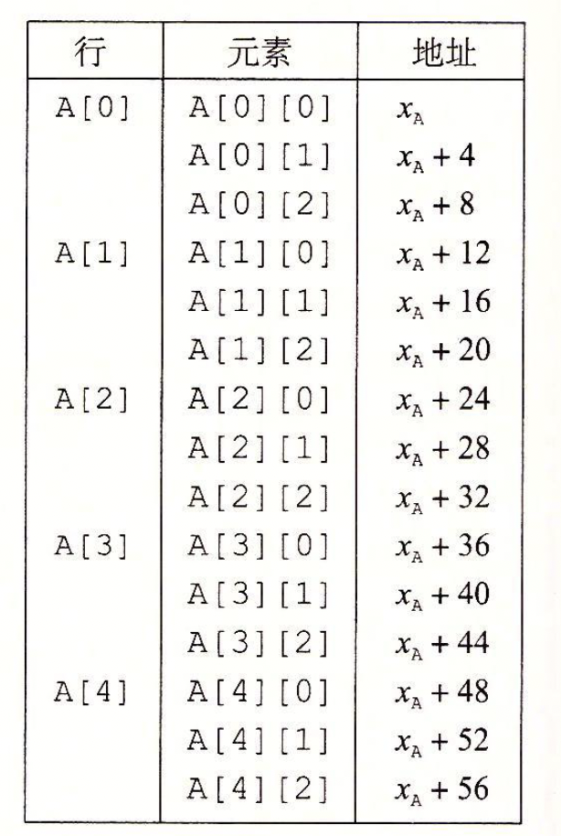

### 3.8.5 变长数组
1. ISO C99 标准引入了变长数组（variable-length array, VLA），允许在声明数组时使用非常量表达式来指定数组的大小
2. 例如如下函数：int val_ele(int n , int A[n][n], int i, int j) { return A[i][j]; } 这里的A是一个n行n列的二维数组

## 3.9 异质的数据结构

### 3.9.1 结构
1. 使用struct来创建类型，结构声明中的变量在内存中按照声明的顺序依次排列

### 3.9.2 联合

1. 提供了一种规避C语言类型系统的方式，允许在同一块内存区域存储不同类型的数据
2. 一个联合的总大小是其最大成员的大小
3. 联合可做到在某些情况下节省内存开销
4. 举例：
   1. 实现一个二叉树的数据结构，每个叶子节点有double类型的数据，而每个内部节点有两个子节点的指针
   2. struct tree_node { struct tree_node *left; struct tree_node *right; double data[2]; };
   3. 由于叶子节点不需要left和right指针，内部节点不需要data数组，因此可以使用联合来节省内存,但是需要一个额外的标志来区分节点类型
   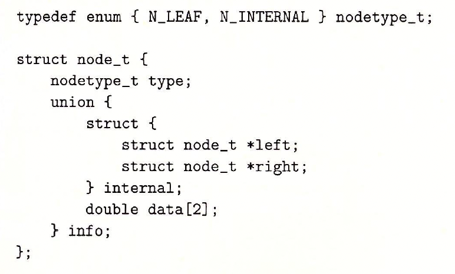
   4. 这里一共只用了24字节，如果直接用struct实现，就要32字节
5. 使用union还可以以不同的数据类型去读取同一段内存的二进制位模式，这在底层编程中被称为Type Punning（类型双关），比如double类型，如果直接转换成long的话会强制把double的值转换成long的值，而不是把double的二进制位模式当作long来读取，所以这里采用union的方式
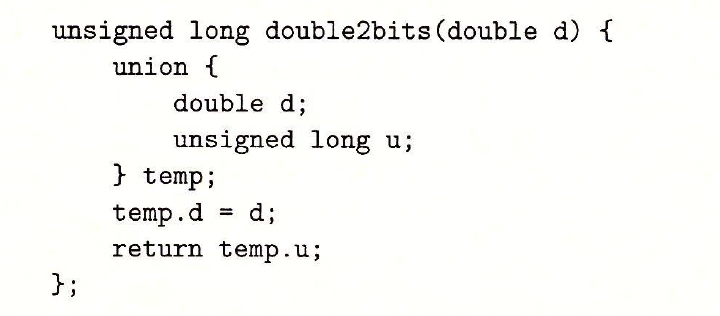
6. 此外，还可以通过union实现例如把内存分为double d和unsigned u[2]，即多种大小不同的类型结合到一起。此时，在x86这样的小端机器上，d的低32位存储在u[0]中，高32位存储在u[1]中。在大端法机器上则相反。

### 3.9.3 数据对齐
1. 无论数据是否对齐，x86-64都能正常工作，不过Intel还是建议对齐数据以提高系统性能

## 3.10 在机器级程序中将控制与数据结合起来

### 1.10.1 理解指针
1. 每个指针对应一个类型
2. 每个指针都有一个值，指向某个内存地址，NULL指针的值为0
3. 指针用&操作符取地址，用*操作符解引用
4. 将指针强制转换时只改变指针的类型，不改变指针的值
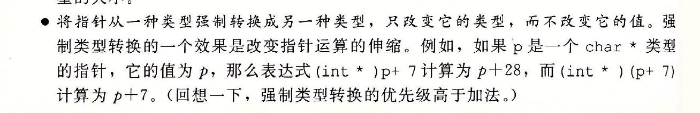
注意对指针的加减是指对内存地址加减，因此这里需要对于size进行伸缩
5. 指针可以指向函数，指向第一个指令的地址

### 3.10.3 内存越界引用和缓冲区溢出

1. 缓冲区溢出：参考gets

### 3.10.4 对抗缓冲区溢出

1. 栈随机化：在程序开始运行时，使用alloca在栈上分配一块随机大小的内存空间，从而改变栈帧的位置；在linux中这已经是一种标准化行为，他是地址空间布局随机化（ASLR）的一部分；常见的攻击方法是空操作雪橇（NOP sled），即在溢出数据前面填充大量的NOP指令，从而增加攻击成功的概率