# Misc Lab 2：隐写与其他 misc

---

# Challenge 1 (10%)
1.  拿来题目发现是一张图片带有flag，但是flag只有一半，所以看一下图像的额外信息。
2.  直接使用v2.3.3版本的binwalk看一下，注意用cargo搭建的最新版binwalk魔法签名有变化，所以反而看不出来这这图片的额外信息。
    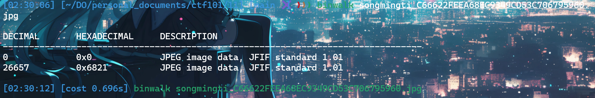
3.  发现26657字节之后其实是一个新的图片，直接用binwalk提取出来就可以看到另一半的flag。
    
4.  最终flag ：`AAA{the_true_fans_nmb_-1s!}`

---

# Challenge 2 (10%)
1.  进入题目发现这个弹窗很讨厌，并且看起来关不掉的样子，所以想看一下源代码。
2.  既然f12看不了，直接request一下试试。
    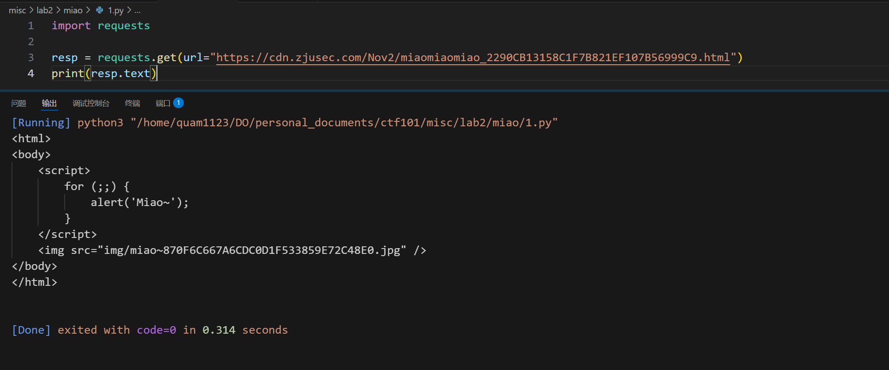
3.  所以直接访问这个url：`https://cdn.zjusec.com/Nov2/img/miao~870F6C667A6CDC0D1F533859E72C48E0.jpg`,就拿到了这个图片。
4.  也是binwalk跑一下，发现偏移30个字节之后有一个tiff格式的文件。
5.  用exiftool查看一下信息发现了有一个key：`m1a0@888`
    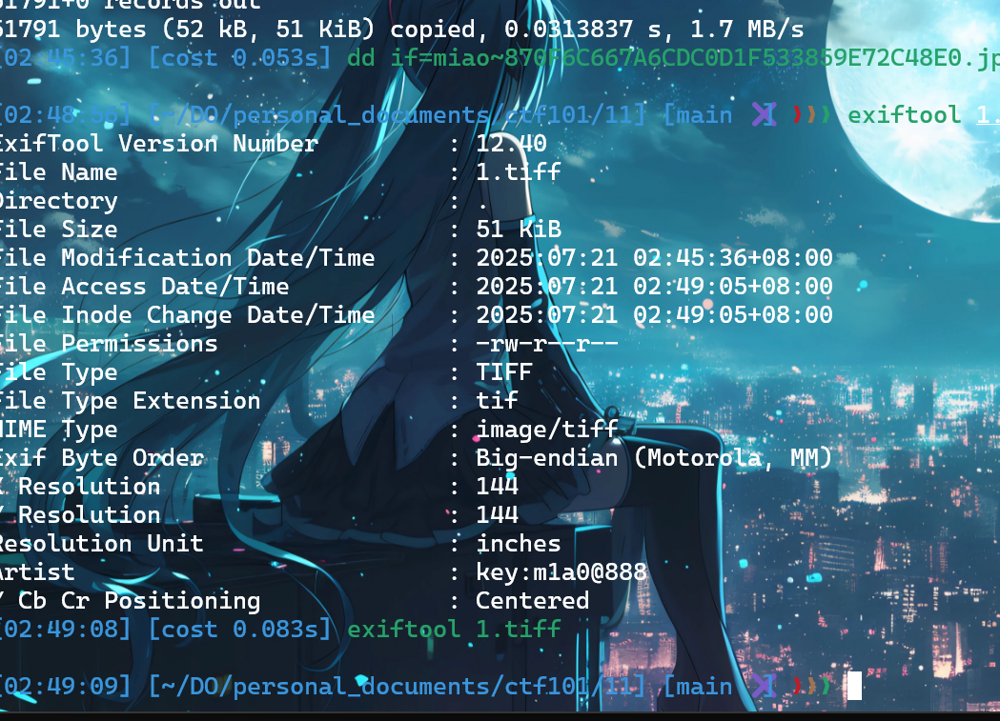
6.  接下来尝试steghide解码，因为这个不能对tiff使用所以直接对原图来。
    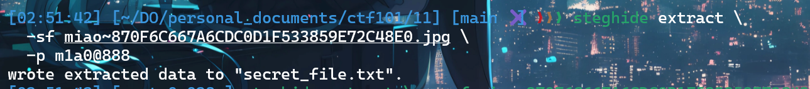
7.  找到，发现是一串二进制字符串，file告诉我们这是01字符串，解码得到flag。
8.  `AAA{D0_Y0u_L1ke_Ste9H1de_M1a0}`

---

# Challenge 3
1.  既然是LSB隐写，直接zsteg启动。
    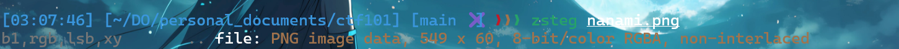
2.  发现了隐藏图片，直接提取出来。发现这个隐藏的图片特别像第一题的那少了半张,然后binwalk走一下发现这是一个很标准的png图片。
3.  但是zsteg告诉我们`207376 bytes of extra data after image end (IEND), offset = 0x44d8`。
4.  但是直接dd出来怎么样也提取不出来有用的信息，所以有可能是CRC校验码和后面的长宽数据被篡改了。
5.  用代码修复了一下这个png图片，主要用到了IHDR块的知识，就可以看到flag。
6.  关键代码：`new_ihdr = struct.pack('>I', new_width) + struct.pack('>I', new_height) + ihdr[8:13]`
    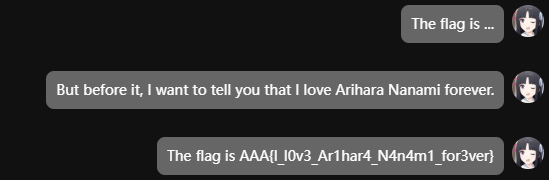

---

# Challenge A: Palette Stego (25%)
1.  这题是ezstego加密，先解释一下具体的加密算法。
    1.  首先，这是针对PNG图片的调色板模式，根据所有颜色的亮度对调色板进行重新排序。
    2.  标准亮度计算公式：`0.299 * r + 0.587 * g + 0.114 * b`
    3.  然后，遍历图片的每一个像素。根据该像素在排序后的调色板中的索引是奇数还是偶数，来隐藏一个比特位（0或1）。
    4.  如果需要隐藏'0'，就选择一个排序后索引为偶数的颜色；如果需要隐藏'1'，就选择一个排序后索引为奇数的颜色。
2.  既然知道加密算法，那就直接逆向出来就好了。
3.  具体的代码也是先使用RGB，计算出每一个像素的亮度值，之后排序，并且建立原index和排序index的表，之后逐行提取。
4.  最后就能得到flag：`AAA{gOoD_joB_P4lEtTE_M0D3_c@N_al$0_57E9o!}`
    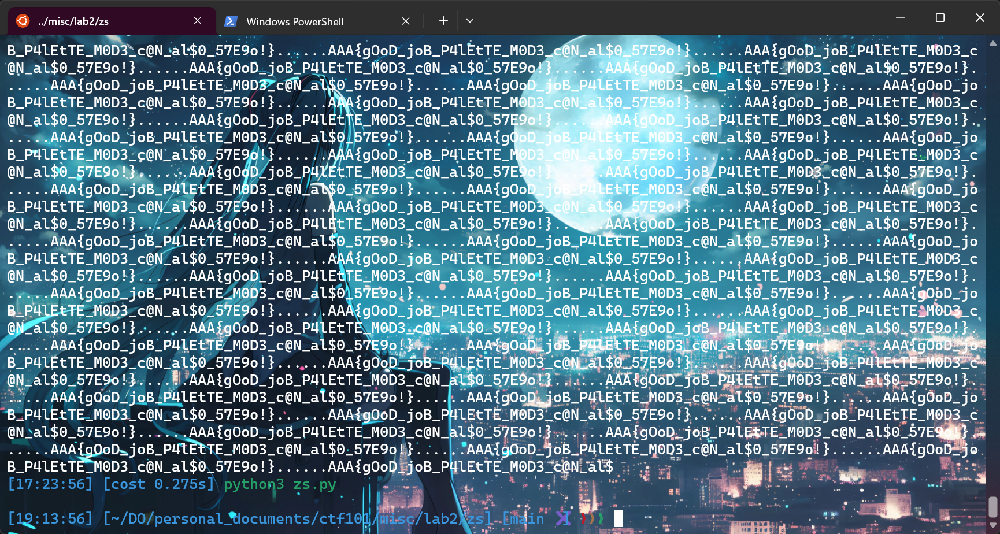

---

# Challenge C: Time & Power (30%)
1.  到手发现只有一个numpy的数组压缩包，解压缩后发现有三个文件：input\_id、input、Power。
2.  input文件是一个索引，一共是39个不同字符的循环。
    
3.  power文件是一个数据包，一共有1053组数据，每组数据有100个float元素，这个大概就是记录功率的。
4.  因为1053 = 39x27，所以猜测这里有27组功率图，每组39张图，每张图100个功率点。
    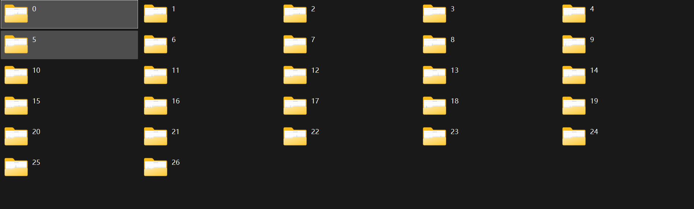
5.  只需要找出每组里面与众不同的那张图，对应的字符循环的就是那一位的flag。
    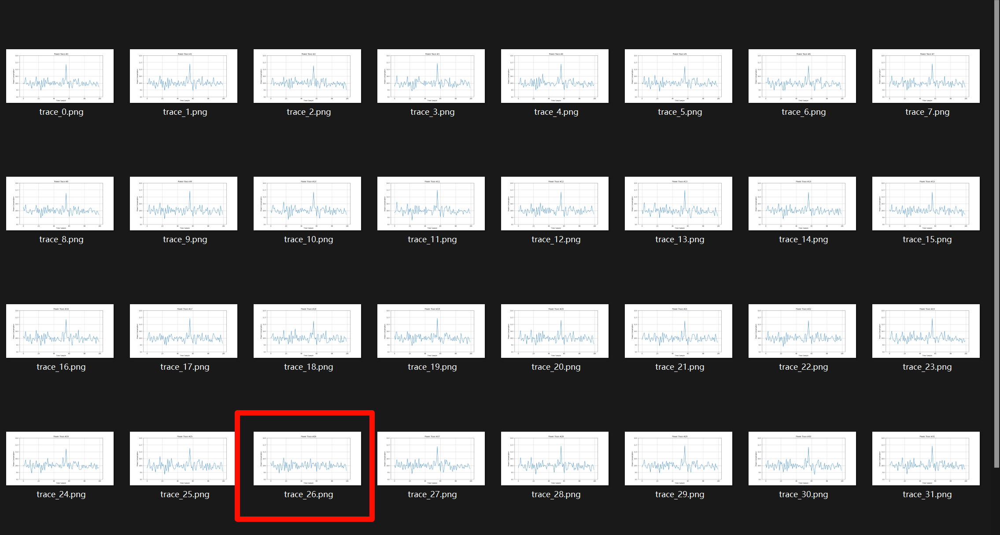
6.  因此我先将这个1053个数据全部保存为折线图，然后分组，查看了前四组，确实对应的flag前4位`0ops`，大多情况是缺一个高峰。
7.  但是这样子看效率低下，并且许多模棱两可的情况，所以干脆直接用代码基于原npy数组找不同。
8.  这里使用了ai，直接让ai根据我的推理生成了一个基于相关性判断的代码
9.  但是ai提取出来的flag有几位不太正确，微调一下就通过了(用肉眼判断的)。
10. flag:`0ops{power_1s_a11_y0u_n55d}`

---

# Challenge E: PPC (30%)
1.  polyglot 
    1.  这道题要求编写一个代码使其既能被g++编译器编译，又能被python执行，并且读出/flag.txt。
    2.  既然需要同时符合两个语言的规范，那就先把最简的语言写出来。
    3.  从这个教程可以知道C++的基本文件流操作：[https://www.runoob.com/cplusplus/cpp-files-streams.html](https://www.runoob.com/cplusplus/cpp-files-streams.html)
        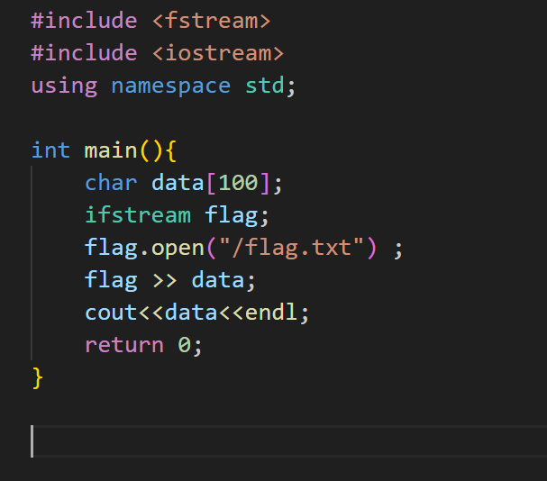
        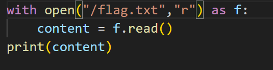
    4.  现在只需要知道怎么把这两个代码放到一起去同时过编译，从py的视角就很简单，只需要把C的代码全部放在三个引号里面，或者通过`#`注释，就不会被识别。
    5.  至于在C++里面想要忽略多行代码，处理多行注释之外还有`#if 0 #end`这样的格式,而且这个正好有`#`，在python里面不会报错！
    6.  所以可以考虑把三个引号放在头部，用`if` `endif`框住，然后写C语句，然后再接另一个`if` `endif`，里面放三个引号和python代码。
        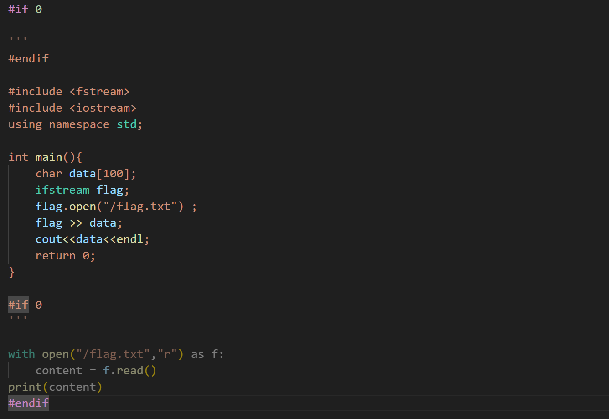
    7.  本地测试通过！接下来直接转base64，我直接用在线工具https://www.base64encode.org/
    8.  然后直接拿下flag：`ZJUCTF{PoLyp1OT_5o_CO0L_maybE_moRe_l4N9uage5_NEX7_tiMe}`