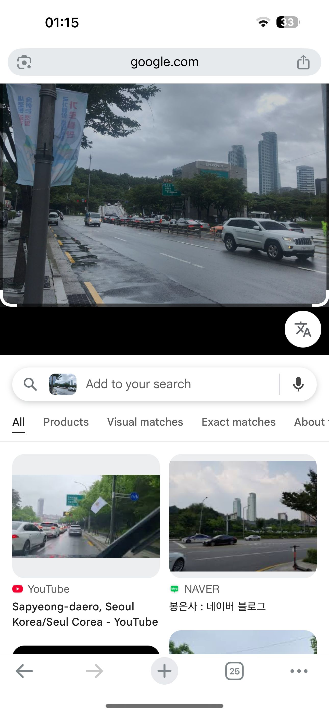
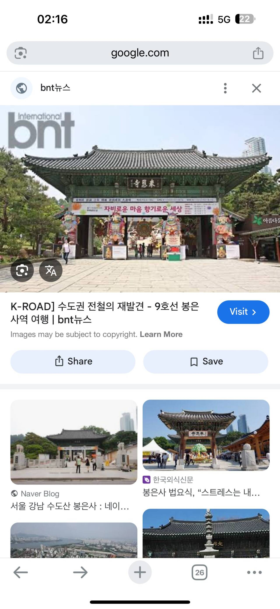
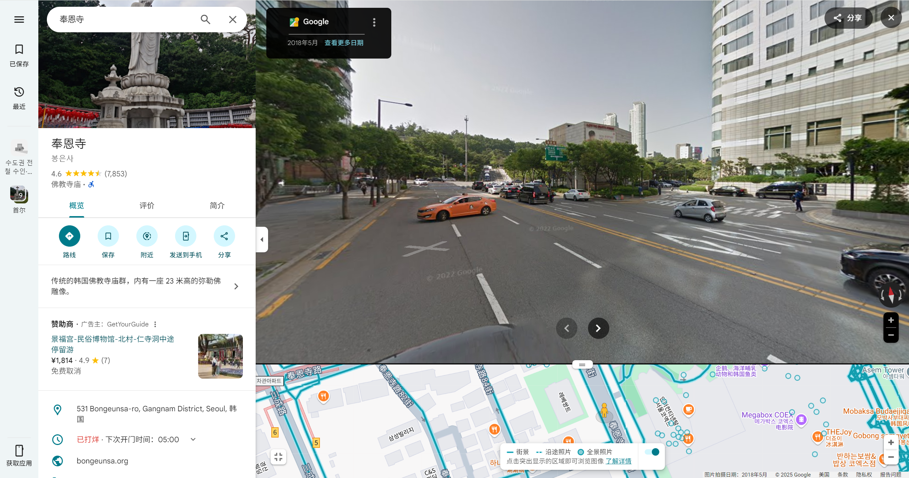
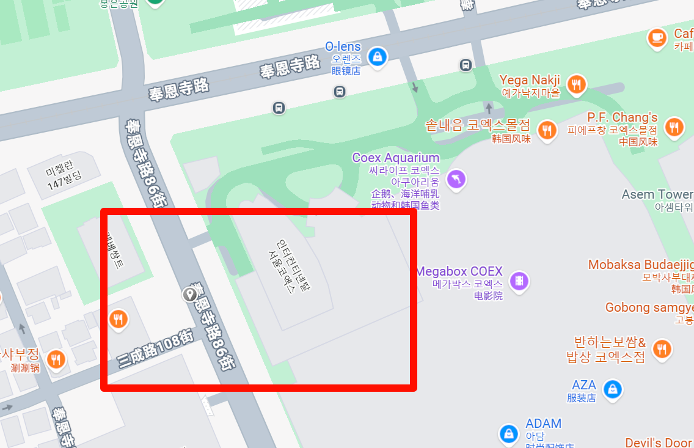
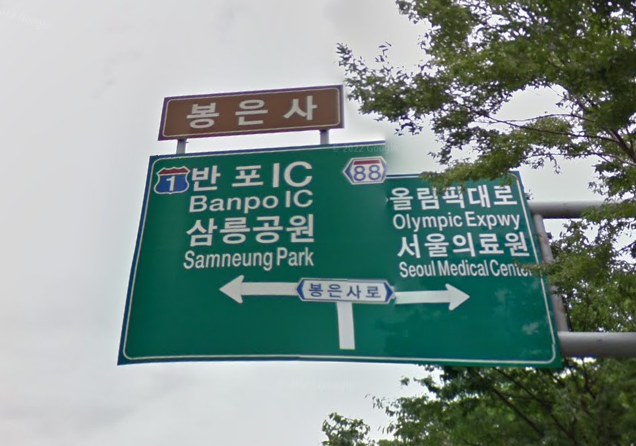
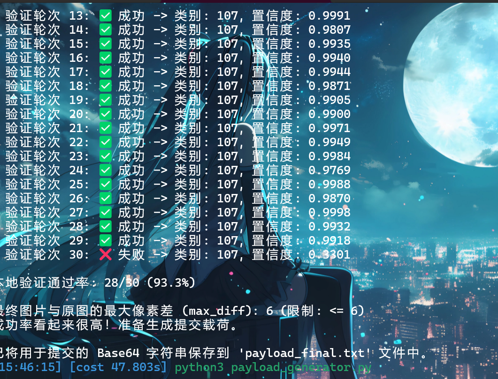
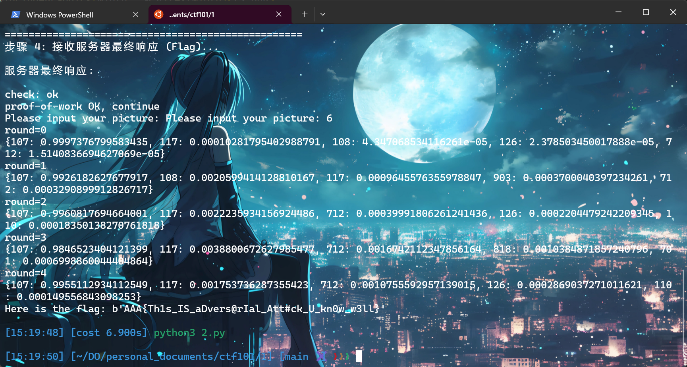

# Misc Lab 3：OSINT & AI

---
由于HomeWork 2 和 HomeWork 4个人感觉完成的不太理想，所以不写上来了

# Homework 1: 图寻
1.  首先是45gfg9 在韩国拍的一张照片，这张图确实有很多信息，但是还是直接放到Google上看一眼。
2.  马上找到相似图片，为右下角的这张，可以看到右边有两个非常相似的鸟嘴高楼。
    
3.  所以立刻可以发现这是韩国的奉恩寺附近，所以我接下来的寻找是围绕着这两座高楼进行。
4.  我接下来以面前大楼的STARKPLUS和LOUNGE的标识找了一会，发现没什么收获（做出来才发现这两个标都改了）。
5.  在更多的图片中，我尝试寻找这个高楼类似的角度，发现都是在奉恩寺的同一个门的右侧。
    
6.  查询发现这个门为南门，所以打开谷歌街景地图。
    
7.  果然这两栋楼就是在南门的右侧出现，同时根据这个大楼鸟嘴的角度，可以判断这个拍摄位置应该在奉恩寺的南门的南边或者东边。
8.  东边寻找无果，我发现箱子哥这张照片的背景是山，所以应该是南边，正对着奉恩寺的山区。
    
9.  OK拿下，路牌也队的上，以及对面的两条分岔路。位置位于奉恩路86街，箱子应该正在前往南门。
    
10. 完整的路牌belike：
    

---

# Homework 3 (35%)
人工智能对抗攻击
1.  这道题目标是生成一张对抗样本图片，需要满足每个像素每个颜色通道的差值绝对值不能超过 6；在经过一系列变换后，你的图片必须被模型识别为第 107 类，通过查询可以知道107`[‘n01910747’, ‘jellyfish’]`。
2.  同时这道题还有一个transform，每次都会从原图`缩放之后`随机裁剪一个区域并缩放到 224x224，并且有 50% 的概率对图片进行水平翻转，最后识别的置信度要高于95%。
3.  攻击代码的核心思想就是投影梯度下降 (PGD) 和 变换期望 (EOT)，每次迭代的过程（比如一共300次）都会计算一个“最优”的修改方向（梯度），修改一点之后并且确保修改后的图片仍在规则允许的范围内（投影）。
4.  而在这个攻击的内层循环，即每次迭代的过程，就是EOT 思想的实现，即通过一个内层循环，模拟服务器的行为 48 次：取出当前正在优化的内容，进行一次完全随机的变换，存进一个列表；在48次结束之后计算平均最优策略。
5.  同时代码里也尽量复现了服务器的模拟测评，计算置信度，通过率几乎能达到28/30。
    
6.  提交在线测评，发现这里还需要一个hashcash的验证，所以干脆再使用一个自动化脚本提交本地的`paylaod_final.txt`文件。
7.  生成的这个base64的文件提交有概率不通过，尝试两次一般就能拿到flag了。
    
8.  flag:`AAA{Th1s_IS_aDvers@rIal_Att#ck_U_kn0w_w3ll}`

