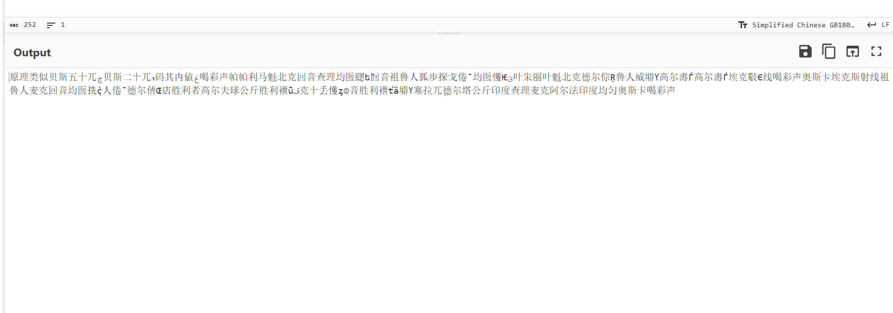
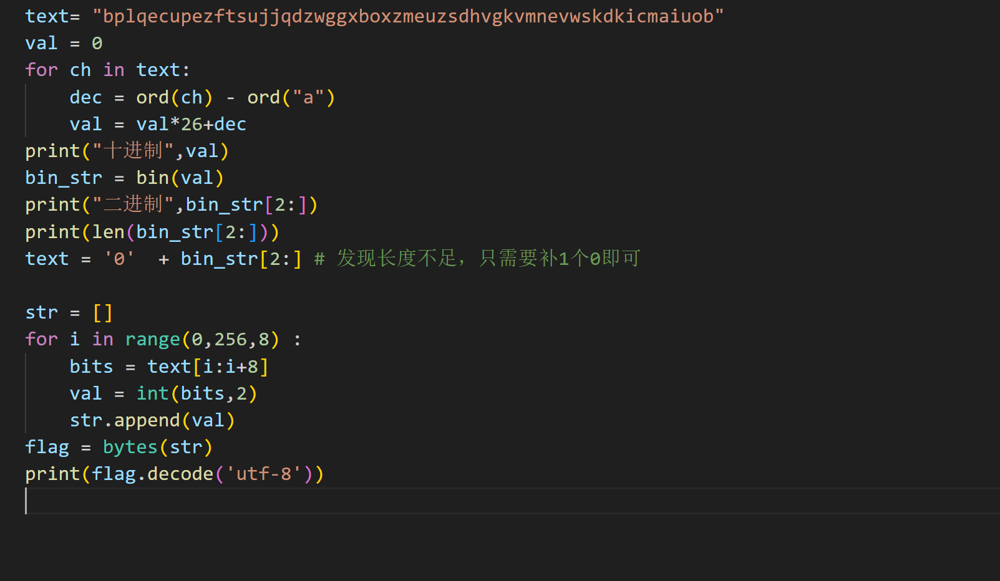
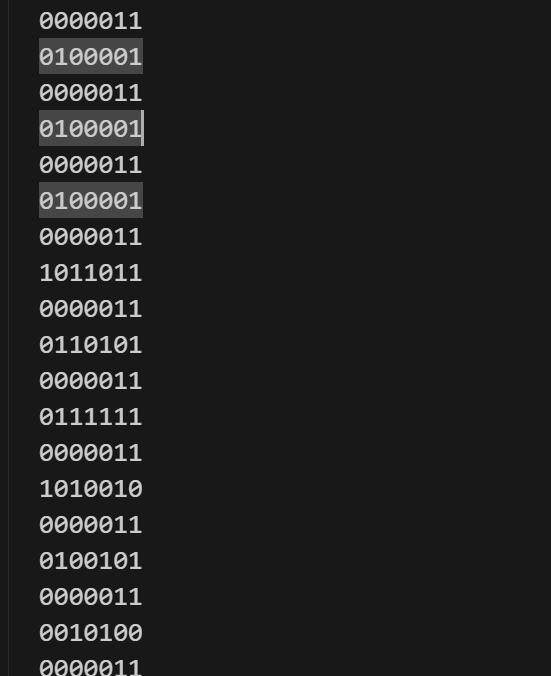
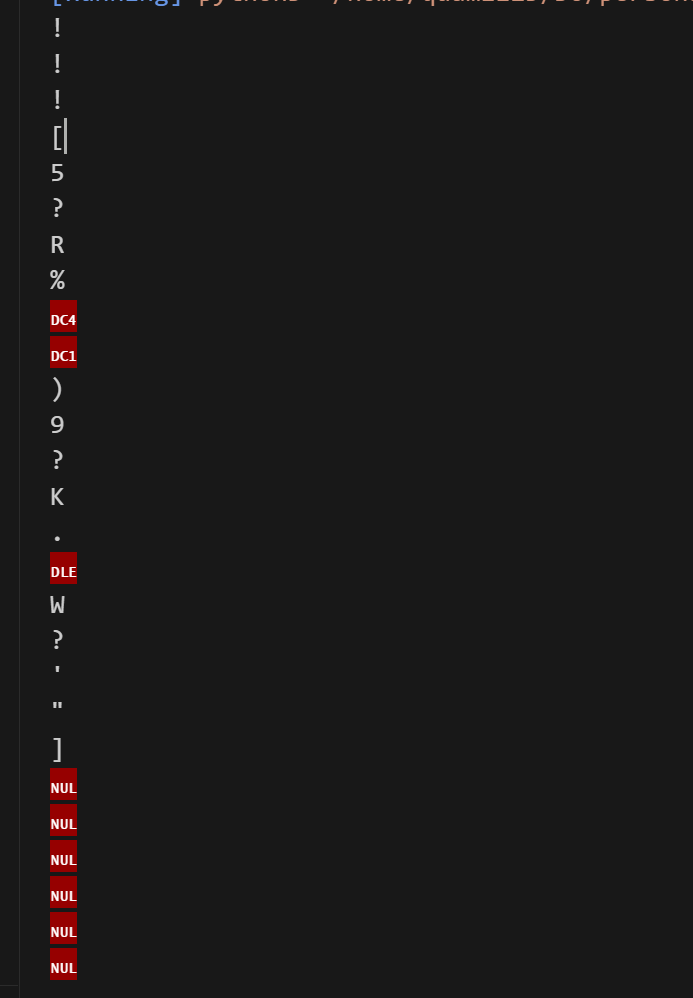
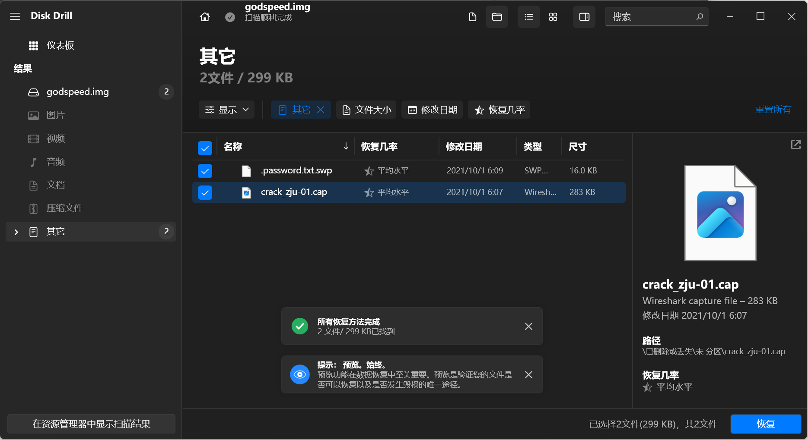
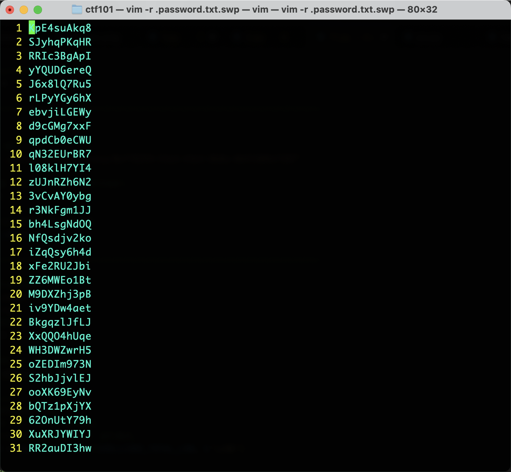
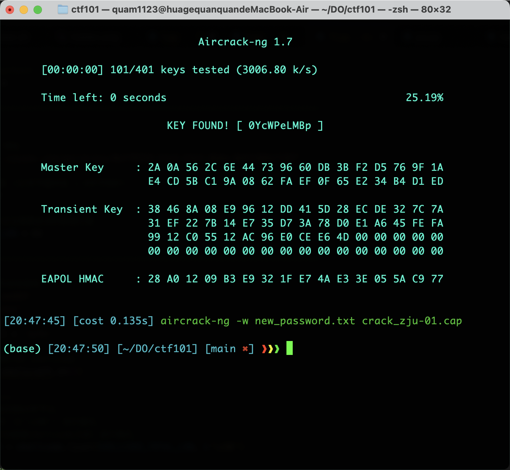

# Misc Lab 1：编解码及流量取证

---

# Task 1
**选择Task1.2：完成 ZJUCTF2023 的 NATO26**

1.  这题上手只有乱码，按照上课的提示，六种方法只能从GBK转utf-8，复制到cyberchef转换一遍后发现大部分变成了易于辨识的简体字，并且十分有规律，出现了许多词的重复。
2.  重新审视题目发现提示了NATO，即上课讲的北约音标字母。
    
3.  这段开头应该是一段提示，提到的可能是BASE编码，因此先对后面的进行翻译编码。
4.  文中大部分的都能直接查表翻译出，但是有个别相对比较混淆，我通过尝试在原文（GBK码文章）里面对应位置加空格，就可以得到被混淆的真实内容，比如：
    
    
    在这里通过加空格，还原出了被藏起来的帕帕（P）。
5.  尝试多次后，可以得出不知对错的一串由字母组成的字符串，这里就可以结合这段话开头的提示，这可能是类似BASE58的“BASE26”编码，即从A到Z分别对应了0到25，相当于一个26进制的数转到16进制，然后每两位16进制数对应一个utf-8编码的字符。
6.  这样的话，如果解码出来的那个字母串是对的，得到的就应该是flag。
7.  在这里我直接转成2进制操作，每8位对应1个utf-8字符，如果位数不是8的整数倍则开头补0。
    
8.  后面的思路根据BASE58编码都很自然，最难的就是得到正确的字符串，在某次转换发现最后一位成功输出了右括号，所以大致确定了一共的位数，至于中间的几个难以分辨的字母，尝试过遍历爆破的方法，最后还是和别人讨论后得出来的。
9.  感觉这个能顺利译出来真是神人了。
10. `ZJUCTF{Y0u_rE@lLy_Kn0W_encODIng}`

---

# Challenge 1：字

1.  **三种字符编码的编码方式**
    1.  GB 2312
        1.  编码方式是定长双字节编码
2.  **GB 系列如何实现三个版本的兼容**

---

1.  其实把原文复制到vscode里面就初见端倪了，提示中提到的那些文字在vscode里面呈现出两种形态，wiki百科告诉我这叫康熙部首。
2.  这里面可以有一种映射，即普通的字对应0，特殊的对应1，然后尝试把这些字统计出来，发现正好是374个字，这和提示恰好对的，因此我们就得到了一个01的字符串。
3.  接下来就是根据提示，对这个01字符串进行分割，由于374是一个比较特殊的长度=11*17，我尝试了多次以11或17进行分割，发现都没有很好的效果，开头往往是不可见字符。
4.  但是后面的0给了我一些启发，这么多0根本就编不出来什么东西，所以可能是无效的部分？
5.  因此我从另一些分割开始尝试，尤其尝试了8位的分割，发现毫无头绪，转出来的utf-8字符根本没什么用。
6.  但是在试到7的时候发现了神奇的分割。
    
7.  这个出现了重复，十分有规律，并且中间夹的3个居然还是一样的字符，很难不往AAA的方向去想。
    
8.  转成ascii之后发现和AAA差了32，所以尝试直接偏移,发现直接得到flag。
9.  `AAA{U_rE41IY_kN0w_GB}`

---

# Challenge 2:软总线流量分析取证
1.  已知两个设备的名字是相同的，它们的名字是什么？
    1.  在wireshark里面直接以字符串形式搜索"devicename",就能看到有两个,可以写成`OpenHarmony_3.2`。
2.  suspicious\_traffic.pcap流量所对应的应用程序是什么？
    1.  字符串形式搜索"appname",发现没有东西，往后面可以看到host，有一个calculator。
3.  目标设备的分布式设备管理组件版本号是什么？
    1.  就是搜索`dmVersion` ，但是要注意有的后面会接一个fake，结果是`5.0.1`。
4.  通信过程使用的软总线版本号是多少？
    1.  搜索softbusversion：`101`。
    2.  拼接之后用md5计算`OpenHarmony\3.2_calculator_5.0.1_101`。
5.  `flag{9cbba4ca92014908452e64de19e3e7ad}`

---

# Bonus
1.  这道题是网络密码的爆破，以及一些文件的处理。
2.  下载下来的安装包解压发现是一个损坏的磁盘文件，用Disk Drill打开之后发现了两个文件，一个是cap流量包文件，一个是.txt.swp，应该是txt文件的交换文件，vim打开时没有保存。
    
3.  之后就直接`vim -r`，就可以看到文件本来的样子，之后直接`:save`。
    
4.  然后直接使用aircrack-ng 对这个流量包进行爆破就行。
    
5.  直接拿到flag:`AAA{0YcWPeLMBp}`