# web_lab1 : 计算机网络基础


---

# Task 1: 网络基础
1.  用校内 DNS 服务器查询 www.zju.edu.cn的 IP 地址:
    1.  `10.10.0.21`为浙大校内DNS服务器IP地址，处于校网内可以直接向它查询。
    2.  指令为 `nslookup www.zju.edu.cn 10.10.0.21`。
        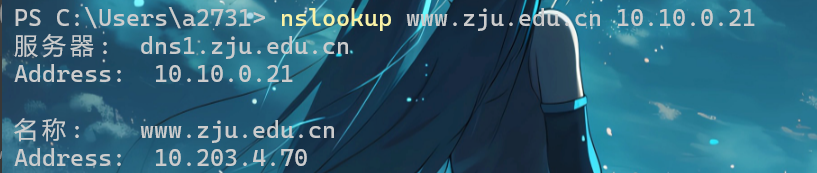
    3.  这是一个权威查询！

2.  用公网 DNS 服务器查询www.zju.edu.cn的 IP 地址：
    1.  取课上示例谷歌的`8.8.8.8`。
    2.  指令为 `nslookup www.zju.edu.cn 8.8.8.8`。
        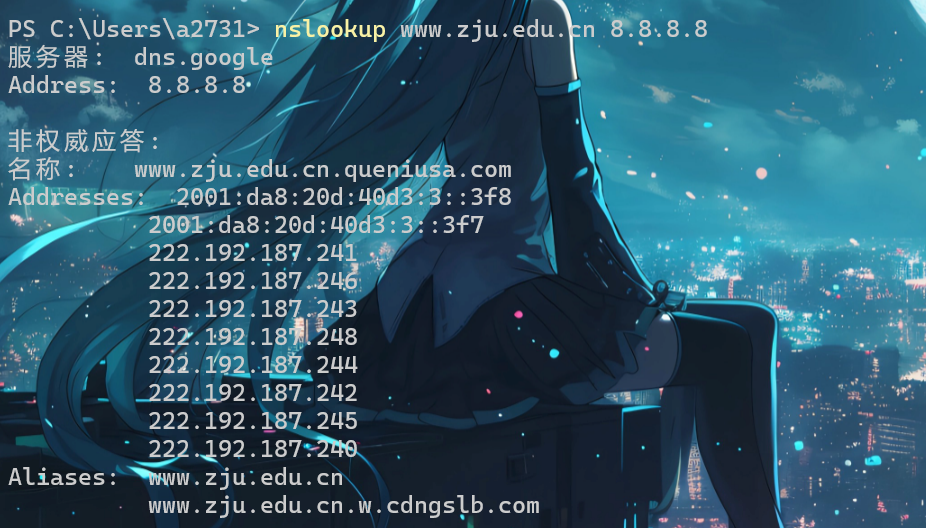
    3.  由于google dns不是zju.edu.cn的权威域名服务器，因此做非权威查询。

3.  测试发现两种方法均会被403，无法直接访问（甚至使用https连接的时候会爆出SSL/TLS的错误），查看IP/域名请求的请求头之后，不断删除发现用域名访问的时候有一个可有可无的cookies，不影响建立连接。
    唯一有影响的是请求头中的Host部分，Host ：www.zju.edu.cn的时候可以正常访问，但是Host为IP的时候就403.我个人猜测原因可能是出在对方Nginx服务器的配置上，虽然我不确定是否这个IP上有多个虚拟主机（因为实在没有找到哪个域名DNS解析后也是这个IP），但是应该是Nginx的config里面指明了特定的的域名（即www.zju.edu.cn）才能访问对应的资源。

4.  至于**是不是服务器的真实地址**，权威查询得到的这个IP应该是网络层的真实地址；而公网DNS查询到的多个IP应该不是真实的地址，而是暴露在外网的一个服务器，把收到的请求处理之后转发到真实的IP地址，至于为什么有这么多个，可能是使用了DNS轮询技术来缓解服务器压力。

5.  至于为什么使用HTTPS请求的时候会爆出SSL/TLS的错误，就有可能是由于使用的IP访问而不是具体域名，Nginx没有记录这一个IP，因此无法返回具体主机的SNI信息（www，或者zdbk、mail之类的），导致握手协议被中断了。但是使用openssl查询这个IP发现，其实会返回一个默认的证书`*zju.edu.cn`，这一步和用`www.zju.edu.cn:443`得到的结果一样的，所以大概率可以确定是SNI没有返回，nginx配置的问题，有可能是只设置了对应域名的放行，也有可能是直接把IP访问的进程杀死了，起WAF的作用。

---

# Task 2: HTTP 原理应用
1.  大致指出页面加载的流程
    1.  首先返回的是最基础的框架html，包括了这个界面的按钮，个别选项，同时在页面中指定了接下来要访问的资源src的地址。
        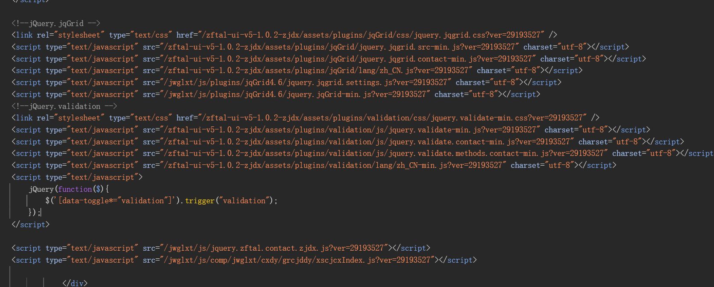
    2.  之后从350ms到500ms的阶段陆续加载完这些资源，但是都没有关键数据。
    3.  630ms左右出现了一个xml文件，内容是：
        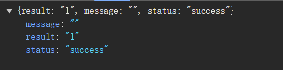
    4.  然后就出现了需要的xhr内容，即返回的成绩。

2.  找接口和参数
    1.  在html里面翻了一会找到了一个看起来比较有价值的script：
        ```html
        <script type="text/javascript" src="/jwglxt/js/comp/jwglxt/cxdy/grcjddy/xscjcxIndex.js?ver=29193527">
        ```
        发现代码的第一行就是喜闻乐见的检查老师评价：
        `.checkMyCosJxpj(); //检查是否完成当前学年学期评价`
        通过**设置XHR断点**的方式，找到了这个函数。
        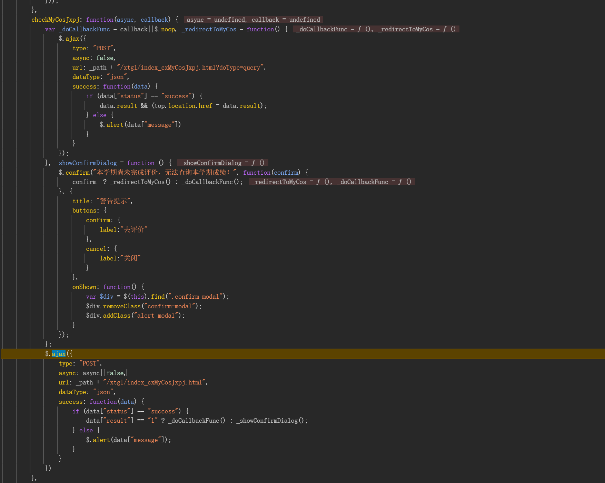
        这个就是第一次看到的XHR内容。

    2.  成绩的获得则是用另一个方法发的请求。
        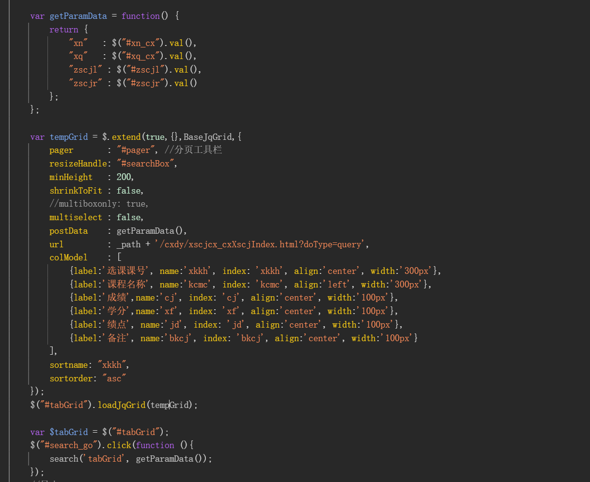
        这里通过构造了一个 `tempGrid` ， 里面包含了各种参数，当然还有url，发起了这个HTTP请求。具体请求的语句是：
        `$("#tabGrid").loadJqGrid(tempGrid);`

3.  实现一个脚本，通过自定义cookies来获取成绩
    1.  既然能自定义cookies，那就不需要实现身份认证模块，直接使用requests库带上浏览器获取的cookies就能得到了。
    2.  编写请求头比较复杂，这样就能直接获取到并保存了。
        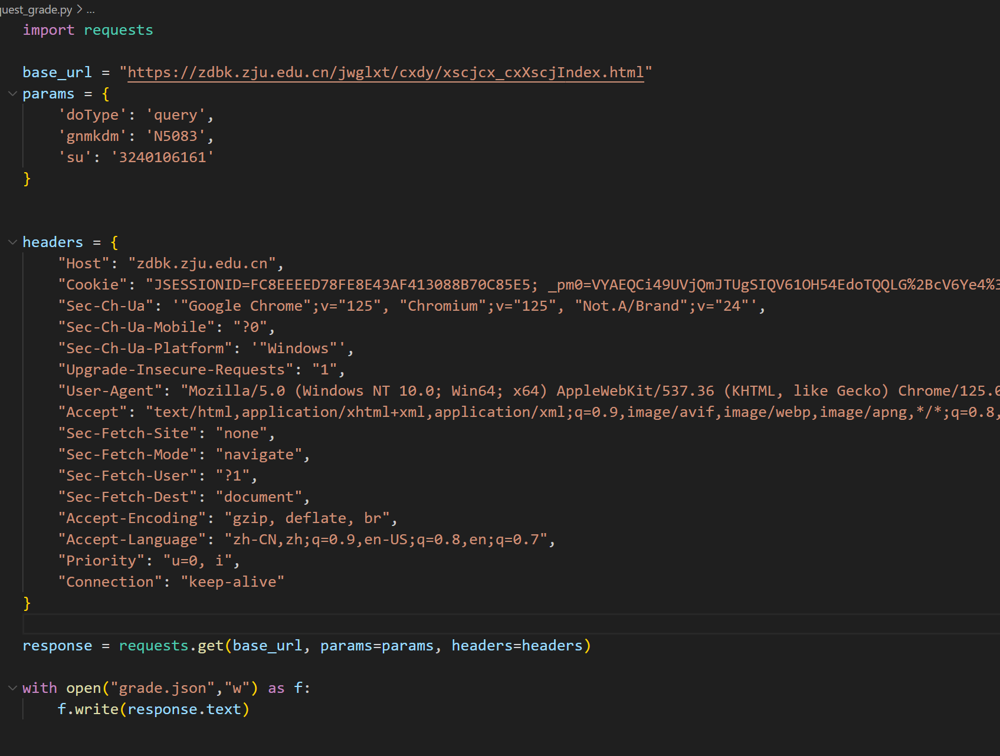
        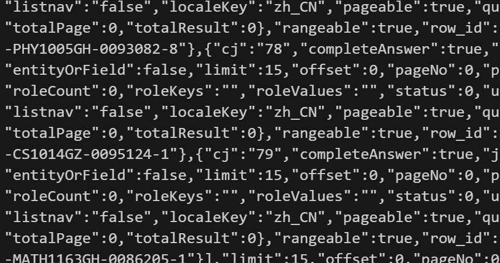
    3.  但是这种请求方式总会过期，想要持续能查询，还是需要通过统一身份认证来获取会话，才能保证每次都能request到成绩。

---

# Task 3: HTTP 请求走私实战
1.  **简述请求走私的原理**
    1.  这个攻击主要是发生在网站前端和后端的服务器对于用户传入的请求处理方式不同导致的。
    2.  HTTP规范提供了两种不同的方法来指定请求的结束位置，即 `Content-Length` 和 `Transfer-Encoding`标头，如果前后端处理的方式不一样，就可能可以使用请求走私的方法来构造一些特殊的请求。
    3.  比如CL-TE的情况下，由于恶意构造的chunked块以`0\r\n`作为结束标识，所以这个之后的内容就会被加在下一次**已经通过前端，前往后端的**请求的头部。

2.  **Lab 实战**
    1.  首先这里要把HTTP协议改成HTTP 1.1 ，直接在Repeater上设置Http 1.1以及请求方式POST,随便发一个请求拿一下cookies，然后就可以得到一个能正常发评论的请求。
    2.  这里就能发现评论的请求里面带有一个csrf，这是教程里面没有的需要自己处理一下。但实际上在构造攻击请求的时候只需要放在chunked块最后就行了，毕竟攻击模块只需要把内容送进去，POST什么东西、什么格式是chunked才需要考虑的事。
        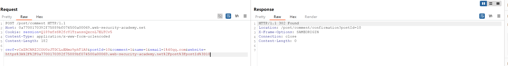
    3.  之后就开始构造Attack 请求，这里很重要的就是content length，网上的在线统计不准确，所以需要自己写一个python脚本来帮助。
        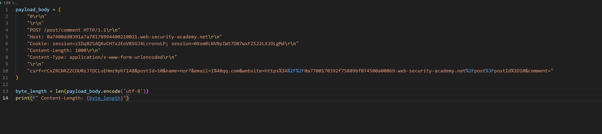
    4.  构造出来的Attack 请求长这样：
        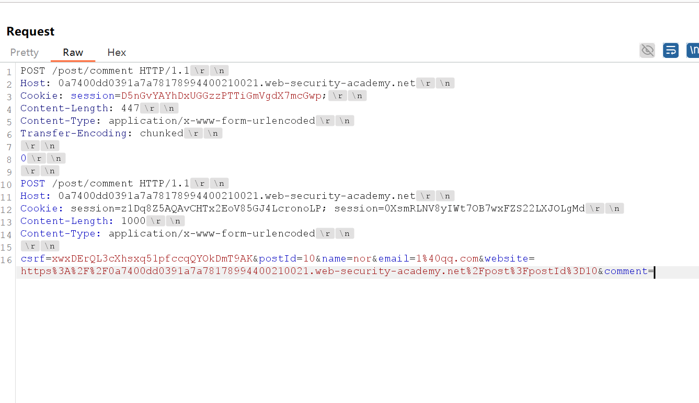
    5.  要注意的就是记得打开右上角的换行标注以及payload要把`comment=`留到最后，这样下一个请求就会成为comment。
    6.  send att之后，再send一个正常的请求，得到了我们想看到的结果。
        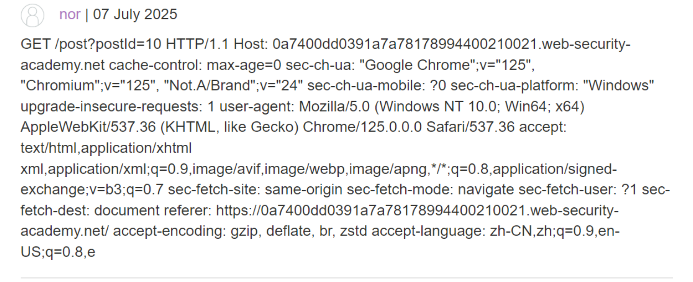
    7.  做report的时候才发现这个cookies 的session完全不影响，因为这几个都不太一样（）。
    8.  我把我的请求源代码放在了http.txt里。

---

# Bonus: 漏洞报告阅读
1.  **解释漏洞成因、简述绕过服务器校验的原理**
    1.  关键原因在于生成签名的方式有漏洞，Steam的Smart2Pay支付方式在验证支付信息的算法过于简单。
    2.  检验支付信息算法的主要流程是支付系统对于用户支付信息，会省略里面的`&`、`=`等内容，直接拼接后得到一个长字符串，服务器在收到你的支付请求后，会用同样的方法再计算一次签名，如果两个签名一致，就说明数据未被篡改。
    3.  因此在这个算法下，`Amount=2000`等价于`Amont2=000`。
    4.  同时，服务器解析这个内容使用的是标准的HTTP协议，不会注重参数的顺序，也会直接丢弃无效的内容。
    5.  这样用户发送的`Amount2=000`不仅能通过哈希检验，而且在HTTP解析是无效的，这样攻击者就能自行构造`Amount`参数。
    6.  作者在报告中提出这只需要构造一个特别的邮箱，在邮箱内部包含了`&Amount=100&`这样一个神奇的零件，就可以在服务器取代`Amount2=000`这个错误、无效的金额信息，成为服务器HTTP解析后的合法对象，实现了绕过服务器校验。