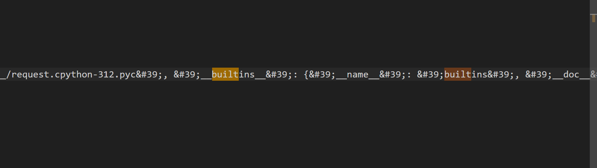
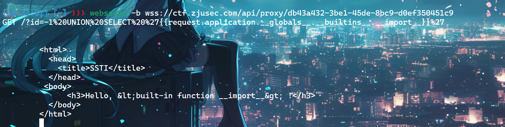
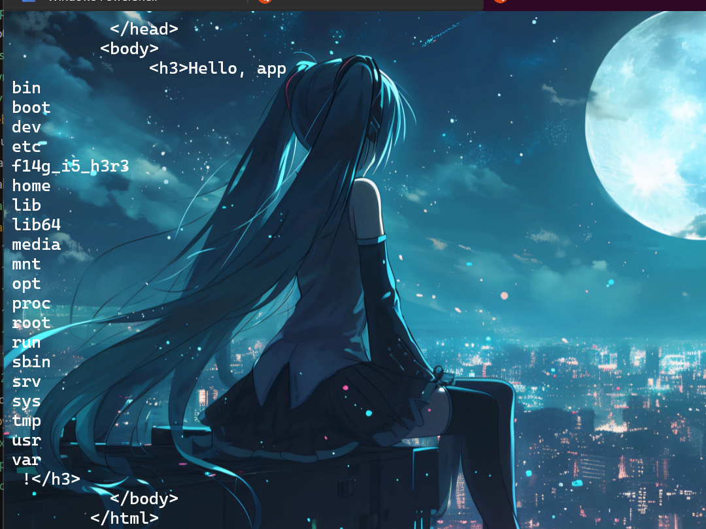
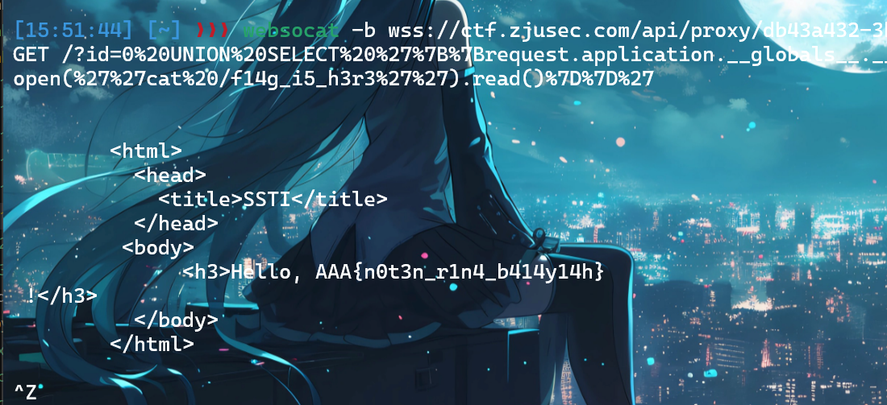
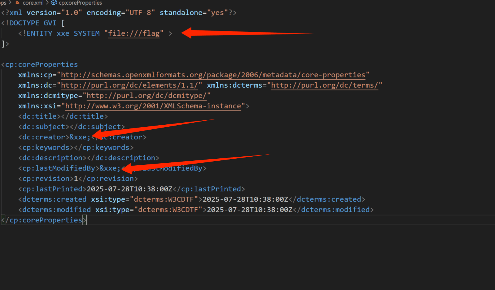
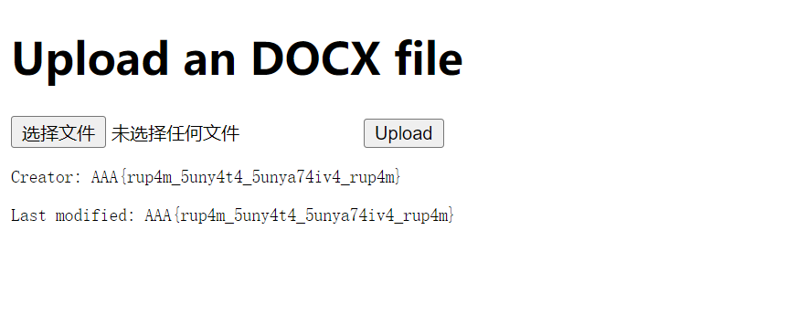

# Web Lab 3：后端漏洞基础

---

# Task1: Being and Code

1.  从源代码可以发现漏洞位于`f"SELECT ... WHERE id = {id}"`这个地方，对于id没有过滤，直接放入html里面，所以会被后端解析，导致可以进行SSTI注入。
2.  我直接使用了PPT里面的代码，在id=-1后面接`UNION SELECT` 查看`config.__class__.__init__.__globals__`,得到了一大堆可用的类，在155位发现了`os_wrap_close`这个关键的函数，所以考虑直接使用这个函数接上ls进行查看，但是总是出现syntax的问题无法解决。
3.  我的payload类似`GET /?id=-1%20UNION%20SELECT%20%27{{%22%22.__class__.__mro__[1].__subclasses__()[155](%27ls%27).read()}}%27`，但是显示错误。
4.  查询ai和google发现另一种路径`request.application.__globals__`,查看global的配置发现了老朋友builtins。
    
5.  既然找不到os，就在这里尝试导入import。
    
6.  发现内置函数`import`，那直接就把os import出来就可以根据上课说的，使用popen来ls查看目录了。
7.  最后的payload：`/?id=0%20UNION%20SELECT%20%27%7B%7Brequest.application.__globals__.__builtins__.__import__(%27%27os%27%27).popen(%27%27ls%20/%27%27).read()%7D%7D%27`
    
8.  接下来把popen后面改成cat就可以了`(%27%27cat%20f14g_i5_h3r3%27%27).read()%7D%7D%27`。
    

---

# Task 2: Yes Author (35%)

1.  这题不能使用websocat，需要使用reflector，然后在浏览器中访问，可以看到需要提交一个docx文件。
2.  docx本质上是一个docx文件，新建了一个docx文件解压后发现里面有很多的xml文件。
3.  可以看到这个网页会解析关于creator的部分，这部分在core.xml里面有体现，PPT上有体现了XXE的注入例子。
4.  所以在这里需要修改一下这个core.xml文件，在头部后面加上读取flag的信息，并且在creator的地方对这个信息加以引用，其实答案就和ppt差不多。
    
    

---

# Task 3: Passcode+ (35%)

1.  已知这个passcodes表的passcode页有我们的passcode，并且有多行，url打开之后只有一个输入密码的位置。
2.  尝试几个常见的注入比如`'or(1=1)--|`发现有过滤器，尝试的过程中发现遇到的有or,and,information,limit,separator,sleep。
3.  测试中观察到的现象是，两个减号不被识别为注释号，开头为引号的情况下大概率进入check\_code.php界面并且没有回显。
4.  所以可以猜测背后的代码结构大概是：
    `$sql = "SELECT * FROM passcodes WHERE passcode = '" . $user_passcode . "'";`
5.  测试发现有效的注释号是`#`,所以可以猜测大概率最后的结构类似`'#`，因为这个结构有回显。
6.  尝试发现or可以用`||`代替，之后发现`'||(1=1)#`居然会返回YOU ARE CHEATING，那说明中间的表达式被判断为真，所以开始考虑构造这个来获取passcode。
7.  感觉结构类似lab0的代码，使用布尔盲注的方式，两个结果就是不同的两个回显。但是测试过程中总是没有回显，所以就想到可能是数据库那一列有很多行的问题，搜索得到有一个函数叫做`con_cat`可以把这一列的所有内容合成一个字符串，所以尝试构造到我们的payload里。
8.  发现现在有回显了,我的payload最终结构为：
    `'||(ascii(substr((select(replace(group_concat(passcode),',',''))from(passcodes)),1,1))=97)#`
9.  所以只要改变位置和ascii值，就可以把所有的passcode抓出来，可以开始写脚本了，发现可以直接往`/check_code.php`里面发包，但是还需要一个`submit`参数。
10. 最终得到我的passcode是`p@55c0d3_0n33n0_3d0c55@p`,直接提交错误，发现轴对称，取左边一半就拿到flag了。
11. 最终flag是`AAA{90tt_wu3rf31t_nich7}`,代码提交为passcode.py。